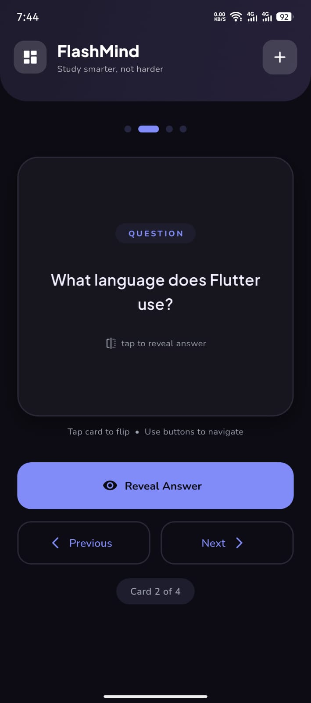
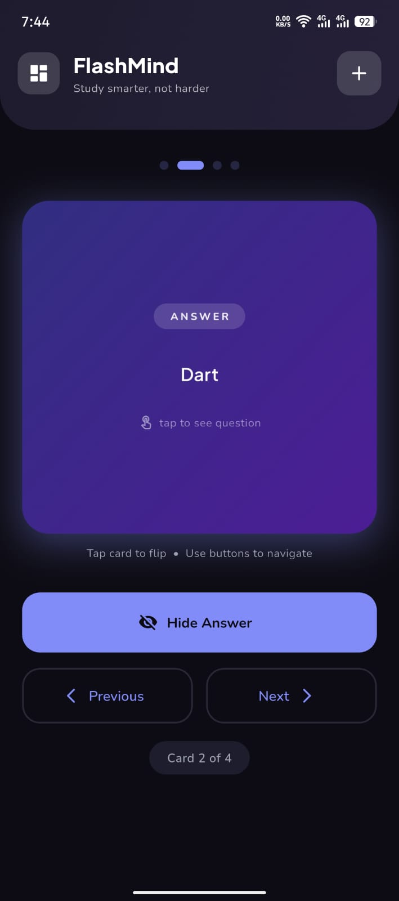
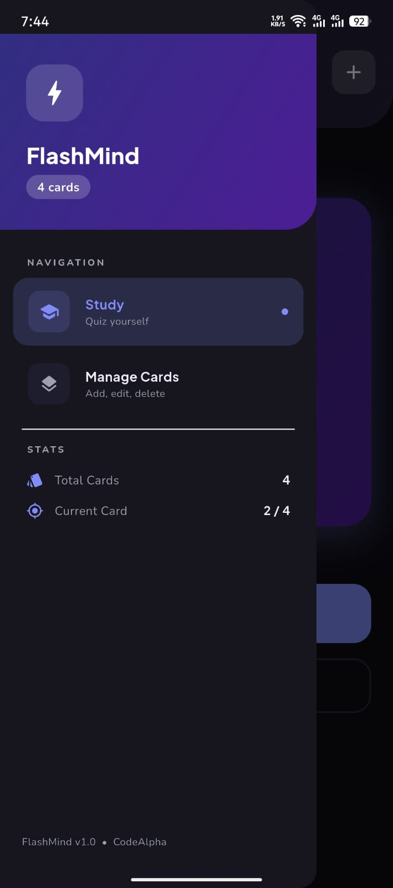
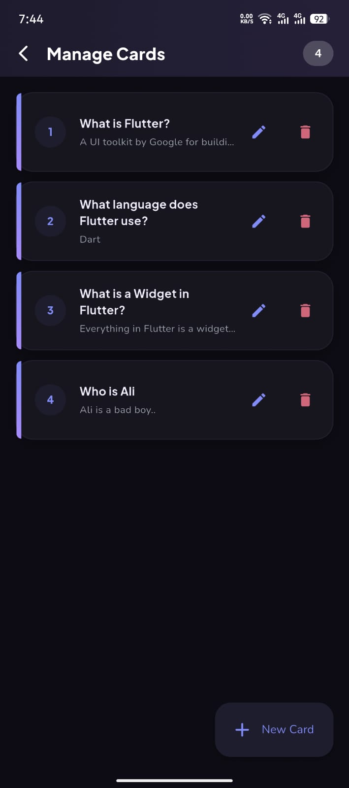
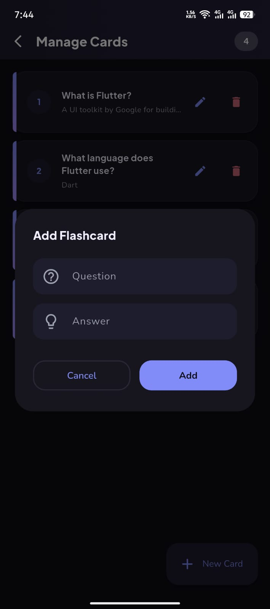

<div align="center">

<br/>

```
███████╗██╗      █████╗ ███████╗██╗  ██╗███╗   ███╗██╗███╗   ██╗██████╗
██╔════╝██║     ██╔══██╗██╔════╝██║  ██║████╗ ████║██║████╗  ██║██╔══██╗
█████╗  ██║     ███████║███████╗███████║██╔████╔██║██║██╔██╗ ██║██║  ██║
██╔══╝  ██║     ██╔══██║╚════██║██╔══██║██║╚██╔╝██║██║██║╚██╗██║██║  ██║
██║     ███████╗██║  ██║███████║██║  ██║██║ ╚═╝ ██║██║██║ ╚████║██████╔╝
╚═╝     ╚══════╝╚═╝  ╚═╝╚══════╝╚═╝  ╚═╝╚═╝     ╚═╝╚═╝╚═╝  ╚═══╝╚═════╝
```

### ⚡ Study smarter, not harder

<br/>


<br/>

> A beautiful, fully-featured flashcard quiz app built with Flutter.  
> Created as **Task 1** of the [CodeAlpha](https://www.codealpha.tech) App Development Internship.

<br/>

</div>

---

## 📸 Screenshots

<br/>

<div align="center">

<table>
  <tr>
    <td align="center">
      
      <br/><sub><b>🏠 Quiz Screen</b></sub>
    </td>
    <td align="center">
      
      <br/><sub><b>🔄 Answer Revealed</b></sub>
    </td>
    <td align="center">
      
      <br/><sub><b>🗂️ Side Drawer</b></sub>
    </td>
  </tr>
  <tr>
    <td align="center">
      
      <br/><sub><b>📋 Manage Cards</b></sub>
    </td>
    <td align="center">
      
      <br/><sub><b>➕ Add Flashcard</b></sub>
    </td>
  </tr>
</table>

</div>

<br/>

> 📱 All screenshots captured on a **real Android device**.

---

## ✨ Features

<br/>

| Feature | Description |
|---------|-------------|
| 🃏 **3D Flip Animation** | Smooth Y-axis card flip with cubic easing — question front, gradient answer back |
| ➕ **Add Cards** | Create flashcards via FAB or the quick-add header `+` button |
| ✏️ **Edit Cards** | Update any card's question or answer from the Manage screen |
| 🗑️ **Delete Cards** | Remove cards with confirmation dialog to prevent accidents |
| 💾 **Persistent Storage** | Cards saved with `SharedPreferences` — survive full app restarts |
| 🔵 **Dot Progress Indicator** | Animated pill-shaped dots tracking position in the deck |
| 🗂️ **Custom Side Drawer** | Gradient sidebar with navigation, live stats, and card count |
| ⚡ **Quick Add Sheet** | Add cards without leaving the quiz screen |
| 🔄 **Wrap-around Navigation** | Next/Prev buttons cycle endlessly through the entire deck |

---

## 🏗️ Project Structure

```
CodeAlpha_FlashcardQuizApp/
│
├── lib/
│   ├── main.dart                        # Entry point + app theme
│   │
│   ├── models/
│   │   └── flashcard.dart               # Flashcard data model (id, question, answer)
│   │
│   ├── providers/
│   │   └── flashcard_provider.dart      # All state — add, edit, delete, flip, save/load
│   │
│   ├── widgets/
│   │   ├── flashcard_widget.dart        # Animated 3D flip card component
│   │   └── app_drawer.dart              # Custom side drawer with gradient header
│   │
│   └── screens/
│       ├── quiz_screen.dart             # Main study / quiz screen
│       └── manage_screen.dart           # Add / Edit / Delete cards screen
│
├── screenshots/                         # Real device screenshots
│   ├── quiz_screen.jpeg
│   ├── answer_revealed.jpeg
│   ├── drawer.jpeg
│   ├── manage_screen.jpeg
│   └── add_card.jpeg
│
├── pubspec.yaml                         # Dependencies
└── README.md
```

---

## 🛠️ Tech Stack

| Technology | Version | Purpose |
|------------|---------|---------|
| **Flutter** | 3.x | UI framework — cross-platform Android & iOS |
| **Dart** | 3.x | Programming language |
| **Provider** | ^6.1.2 | State management — shared data across all screens |
| **SharedPreferences** | ^2.3.2 | Local key-value storage — persists card data |
| **Google Fonts** | ^6.2.1 | Typography — Plus Jakarta Sans + Nunito |
| **Material 3** | built-in | Design system |

---

## 🚀 Getting Started

### Prerequisites

Verify your Flutter environment:

```bash
flutter doctor
```

All items must show ✅. Follow the [Flutter install guide](https://flutter.dev/docs/get-started/install) if needed.

### Installation & Run

```bash
# 1. Clone the repo
git clone https://github.com/Ali-Hassan-edu/CodeAlpha_FlashcardQuizApp.git
cd CodeAlpha_FlashcardQuizApp

# 2. Install dependencies
flutter pub get

# 3. Run on device / emulator
flutter run

# 4. Build release APK
flutter build apk --release
# → build/app/outputs/flutter-apk/app-release.apk
```

---

## 📦 pubspec.yaml — Dependencies

```yaml
dependencies:
  flutter:
    sdk: flutter

  provider: ^6.1.2            # State management
  shared_preferences: ^2.3.2  # Local storage
  google_fonts: ^6.2.1        # Beautiful typography
```

---

## 🎯 Architecture

### Provider Pattern

```
┌──────────────────────────────────────────────────┐
│               FlashcardProvider                   │
│                                                   │
│  State :  List<Flashcard>  ·  currentIndex        │
│           showAnswer       ·  isLoading           │
│                                                   │
│  Actions: add · edit · delete · flip              │
│           next · previous · goToCard              │
│           _saveCards()  ←→  _loadCards()          │
└─────────────────┬────────────────────────────────┘
                  │   context.watch / context.read
        ┌─────────┴──────────┐
        ▼                    ▼
   QuizScreen           ManageScreen
 (reads & displays)   (mutates state)
```

### Card Flip — How It Works

```dart
// 0.0 → π  (half revolution on Y axis)
_animation = Tween<double>(begin: 0, end: math.pi).animate(
  CurvedAnimation(parent: _controller, curve: Curves.easeInOutCubic),
);

// Past halfway (π/2)?  → render back face + counter-rotate π
// so the text is never rendered as a mirror image
final isPastHalf = _animation.value > (math.pi / 2);
```

### Storage Flow

```
App starts
    │
    ▼
SharedPreferences.getString('flashcards')
    ├── JSON found  →  jsonDecode  →  List<Flashcard>  →  show cards
    └── Not found   →  load 4 demo seed cards          →  show cards

On add / edit / delete:
    List<Flashcard>  →  jsonEncode  →  SharedPreferences.setString
```

---

## ✅ Task Requirements Checklist

**Task 1 — Flashcard Quiz App · CodeAlpha Internship**

| Requirement | Status |
|-------------|--------|
| Flashcard with question on front | ✅ |
| "Show Answer" button to reveal back | ✅ |
| Next and Previous navigation | ✅ |
| Add new flashcards | ✅ |
| Edit existing flashcards | ✅ |
| Delete flashcards | ✅ |
| Simple and clean UI | ✅ |

### 🚀 Bonus — Beyond Requirements

| Bonus Feature | Implementation |
|---------------|----------------|
| 3D flip animation | Y-axis `Matrix4.rotateY()` with `easeInOutCubic` |
| Animated dot progress | Width animates from 8 px → 24 px on active card |
| Persistent local storage | `SharedPreferences` JSON save on every mutation |
| Custom gradient side drawer | Stats, navigation tiles, branding, card count |
| Quick-add bottom sheet | Add card from quiz screen without navigating away |
| Gradient answer face | Indigo-to-violet gradient with glowing box shadow |
| Demo seed cards | 4 cards preloaded on first launch |

---

## 🎓 Internship Info

<div align="center">

| | |
|--|--|
| **Company** | CodeAlpha |
| **Domain** | App Development |
| **Task** | Task 1 — Flashcard Quiz App |
| **Framework** | Flutter (Dart) |
| **Year** | 2026 |
| **Website** | [www.codealpha.tech](https://www.codealpha.tech) |

</div>

---

## 📁 Repository Name

Per CodeAlpha internship submission guidelines:

```
CodeAlpha_FlashcardQuizApp
```

---

## 👤 Author

<div align="center">

**Ali Hassan**

[](https://www.linkedin.com/in/ali-hassan-45b9b53b0)
[](https://github.com/Ali-Hassan-edu)

</div>

---

## 📄 License

```
MIT License — free to use, modify, and distribute.
```

---

<div align="center">

Made with ❤️ using Flutter &nbsp;•&nbsp; CodeAlpha App Development Internship 2026

⭐ **Star this repo if you found it helpful!**

</div>
